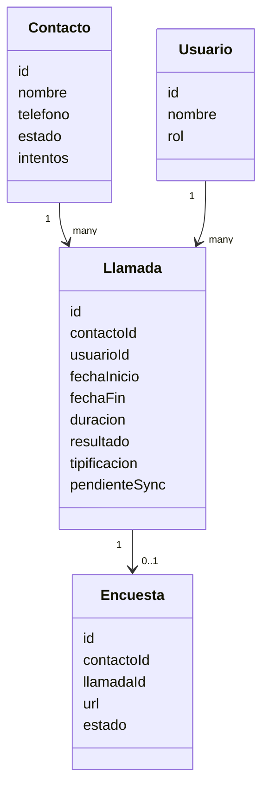
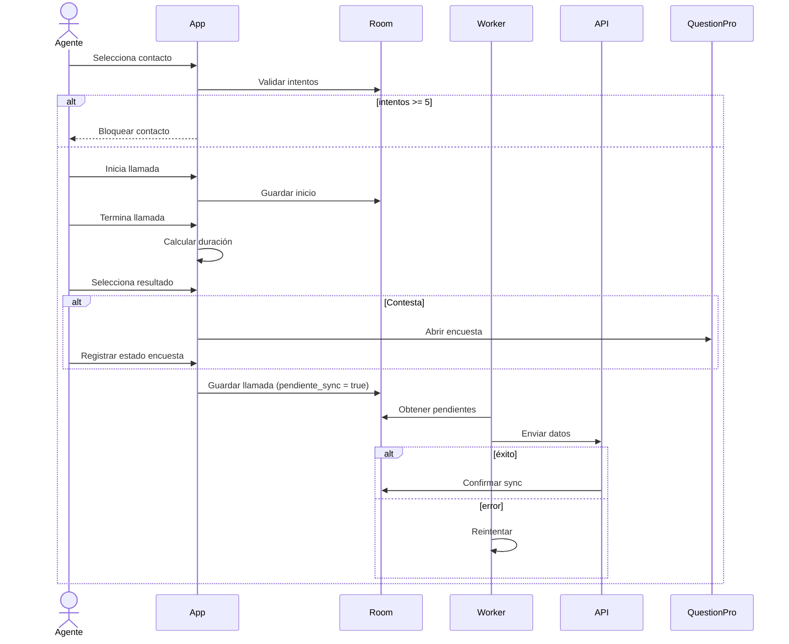
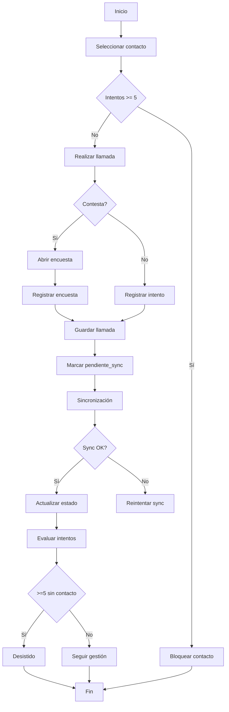

# 4+1 Architecture Diagrams (Mermaid) - FINAL VERSION (Antigravity Ready)

---

## 🧩 1. Vista Lógica (Clases / Dominio)



---

## ⚙️ 2. Vista de Desarrollo (CSRM + Data Sources)

```mermaid
graph LR

UI[Jetpack Compose UI]
VM[ViewModel]

UC[UseCases / Service Layer]

Repo[Repository]

LocalDS[Local DataSource (Room)]
RemoteDS[Remote DataSource (API)]

Worker[WorkManager Sync]

DBLocal[(SQLite)]
APIRest[REST API]
DBRemote[(PostgreSQL)]

UI --> VM
VM --> UC
UC --> Repo

Repo --> LocalDS
Repo --> RemoteDS

LocalDS --> DBLocal
RemoteDS --> APIRest

Worker --> Repo

APIRest --> DBRemote
```

---

## 🔄 3. Vista de Procesos (Flujo completo con offline + sync)



---

## 🌐 4. Vista Física (Despliegue)

```mermaid
graph TD

Device[Android Device]
App[App Kotlin + Compose]
Worker[WorkManager]

Backend[Backend Server]
Auth[Auth Service (JWT)]
DB[(PostgreSQL)]

External[QuestionPro]

Device --> App
App --> Worker

App -->|HTTPS| Backend
Backend --> Auth
Backend --> DB

App -->|WebView / Browser| External
```

---

## 👤 5. Vista de Escenarios (Caso completo)



---

## 📌 Notas

* Arquitectura basada en **CSRM (Client–Service–Repository–Model)**
* Estrategia **offline-first con sincronización automática**
* Integración externa con **QuestionPro**
* Regla crítica: máximo **5 intentos por contacto**
* Persistencia dual: **Room (SQLite) + PostgreSQL**

---
