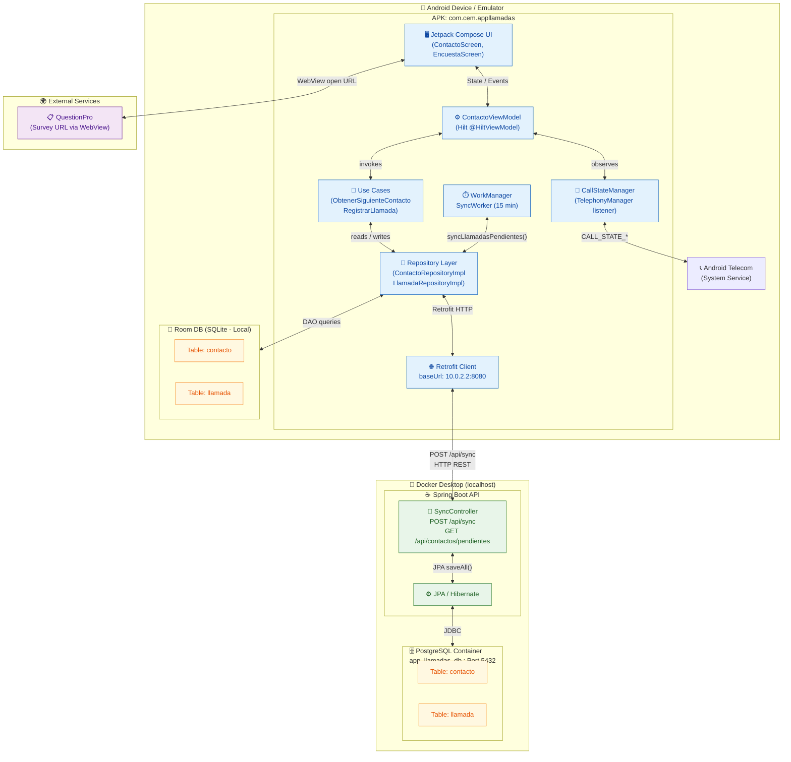

# Deployment Diagram — App Llamadas



---

## Deployment Nodes

| Nodo | Tecnología | Ubicación |
|------|-----------|-----------|
| Android App (APK) | Kotlin + Jetpack Compose + Hilt | Dispositivo / Emulador |
| Room DB | SQLite (local, offline-first) | Dispositivo / Emulador |
| Spring Boot API | Kotlin + Spring Boot 3.2, puerto `8080` | `localhost` (Docker) |
| PostgreSQL | Postgres 15-alpine, puerto `5432` | Contenedor Docker |
| QuestionPro | SaaS externo | Internet |

## Flujo de sincronización

```
[Room (pendiente_sync=true)] → WorkManager cada 15 min
    → Retrofit POST /api/sync → Spring Boot → PostgreSQL
    ← Confirmación → pendiente_sync = false
```

## Conectividad offline-first

```
Online:  Android ──HTTP──▶ Spring Boot ──JDBC──▶ PostgreSQL
Offline: Android ──DAO──▶  Room (SQLite local) ──WorkManager──▶ cola pendiente
```
